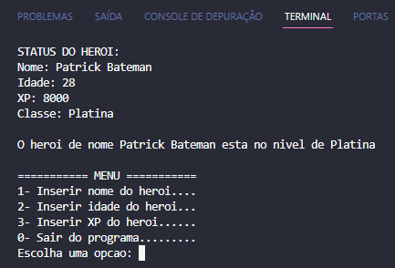

<h1 align="center">Ranked games calculator:</h1>

## 📖 About the project
In this project, I created an interactive program through an easy and intuitive menu. The menu is composed of conditionals and loops, with basic information validation. After each input, the program automatically updates the information. <br>
I chose the C language for this project as I wanted to practice it and, not only that, but also to employ a lower-level language for the logic and programming challenges of the DIO 'Potência Tech iFood - Programming from Scratch' bootcamp."



### 1️⃣ Hero Level Classifier Challenge

**What should be used**

- Variables
- Operators
- Loops
- Decision Structures

### Objective

Create a variable to store the name and experience points (XP) of a hero, then use a decision structure to display one of the messages below:

If XP is less than 1,000 = Iron <br>
If XP is between 1,001 and 2,000 = Bronze <br>
If XP is between 2,001 and 5,000 = Silver <br>
If XP is between 6,001 and 7,000 = Gold <br>
If XP is between 7,001 and 8,000 = Platinum <br>
If XP is between 8,001 and 9,000 = Ascendant <br>
If XP is between 9,001 and 10,000 = Immortal <br>
If XP is greater than or equal to 10,001 = Radiant

### Output

In the end, display the message:
"The hero named **{name}** is at the level of **{level}**"

## 🦾 Technologies used
<div style="display: flex;">
  


</div>

## 🤔 What i learned
- Basically, I just improved my skills in something I already know because this bootcamp challenge is a basic introduction to coding.

## 👽 How to clone this project

````bash
    # Select where you want to clone
    $ cd ~/Documents/WHERE_YOU_WANT
````

````bash
    # Clone the project
    $ git clone https://github.com/DevGustavus/REPOSITORY_NAME.git
````

````bash
    # Check if cloning worked fine
    $ cd ~/Documents/DIRECTORY_LOCATION
    $ ls
````
